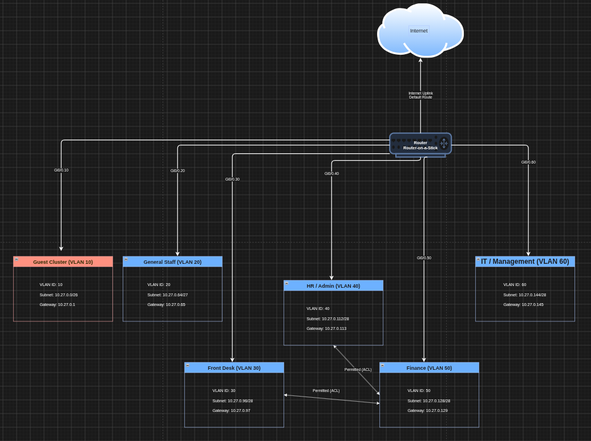

# Logical Topology

The logical topology represents the network’s structure independent of the physical location, it shows how VLANs, IP subnets and routing are organized to control traffic flow between zones.

## VLAN and Subnet Structure

Each zone is implemented as a separate VLAN with its own IP subnet.

| Zone | VLAN ID | Network Address | Gateway |
|---|---|---|---|
| **Guest Wifi** | 10 | 10.27.0.0/26 | 10.27.0.1 |
| **General Staff** | 20 | 10.27.0.64/27 | 10.27.0.65 |
| **Front Desk** | 30 | 10.27.0.96/28 | 10.27.0.97 |
| **HR / Admin** | 40 | 10.27.0.112/28 | 10.27.0.113 |
| **Finance** | 50 | 10.27.0.128/28 | 10.27.0.129 |
| **IT / Management** | 60 | 10.27.0.144/28 | 10.27.0.145 |

## Routing Design

Inter-VLAN routing is implemented using router-on-a-stick, which is a single physical router interface connected to the switch through a trunk link, configured with a separate logical sub-interface per VLAN. Each sub-interface acts as the default gateway for its corresponding VLAN. All traffic requiring inter-VLAN routing or internet access pass through this single trunk link, which is bundled using EtherChannel to provide additional bandwidth and redundancy.

## Traffic Flow Rules

1. Guest Wifi is fully isolated, it can only access internet and no other VLAN.
2. General Staff is isolated from Finance, HR and Front Desk, it access internet only.
3. Front Desk can access Finance and Finance can access Front Desk.
4. Front Desk can access HR and HR can access Front Desk
5. HR can access Finance and Finance can access HR.
6. IT/Management has administrative access to all VLANs, for configuration, Monitoring and security purposes.

These rules are enforced on the router using access control lists (ACLs) applied per sub-interface, restricting inter-VLAN traffic to only the permitted paths.

## Logical Topology Drawing

