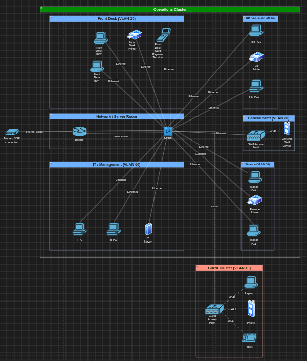

# Physical Topology

The client brief does not provide a floor plan or a physical layout of the Ngwedi Country Inn (Kimberley) property, so a simplified physical model was adopted to produce a physical topology. Rather than attempting to model exact room-by-room placement, the property is represented as two physical clusters, a guest cluster and operations cluster covering Front Desk, Finance, HR, IT and general staff areas. The property is single storied with guest rooms grouped separately from administrative and operational areas.

Each cluster is served by its own access point, which provides wireless coverage without unnecessary hardware duplication, this is to remain consistent with the client’s constraint of minimizing waste. The guest cluster’s access point serves as Guest Wifi VLAN, while the operations cluster’s access point serves the General Staff VLAN though dual-SSID configuration as staff moves throughout the property.

## Physical Devices

| Device | Quantity | Location |
|---|---|---|
| **Router** | 1 | Network / Server room, router-on-a-stick configuration |
| **Switch** | 1 | Network / Server room, connects all wired zones and both access points |
| **Access Point** | 2 | One per cluster |
| **Front Desk PC** | 2 | Reception Area (Operations cluster) |
| **Front Desk Printer** | 1 | Reception Area (Operations cluster) |
| **Card Payment Terminal** | 1 | Reception Area (Operations cluster) |
| **HR PC** | 2 | HR Office (Operations cluster) |
| **HR Printer** | 1 | HR Office (Operations cluster) |
| **Finance PC** | 2 | Finance Office (Operations cluster) |
| **Finance Printer** | 1 | Finance Office (Operations cluster) |
| **IT PC** | 2 | Network / Server room (Operations cluster) |
| **IT Server** | 1 | Network / Server room (Operations cluster) |
| **Modem / ISP Connection** | 1 | Network / Server room (Operations cluster), router uplink to internet |
| **Guest Devices** (representative) | 3 icons | Represents 40 guest devices through Guest AP |
| **Staff Devices** (representative) | 1 icon | Represents 20 staff devices through Staff AP |

## EtherChannel Placement

Etherchannel is implemented on the link between the switch and the router, bundling multiple physical cables into a single logical connection. This link was chosen because it is the only path connecting the switch to the router in the router-on-a-stick design, meaning it carries all inter-VLAN traffic such as Front Desk to Finance, HR to Finance as well as all internet bound traffic for every zone in the network.

Bundling this link with EtherChannel provides two benefits. It increases the available bandwidth across the switch-router connection by combining multiple links into one, this reduces the risk of this link becoming a bottleneck as traffic from all VLANs converges on it. It also introduces redundancy because if one cable in the bundle fails, the traffic automatically continues over the remaining cables, this prevents a single point of failure from disconnecting every zone in the network at once.

## Physical Topology Drawing

