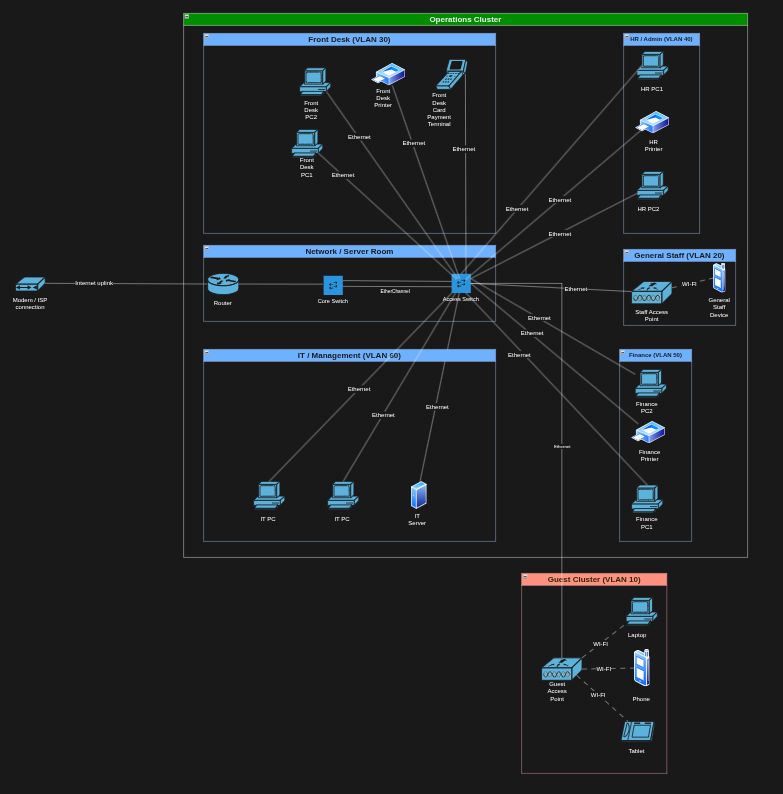
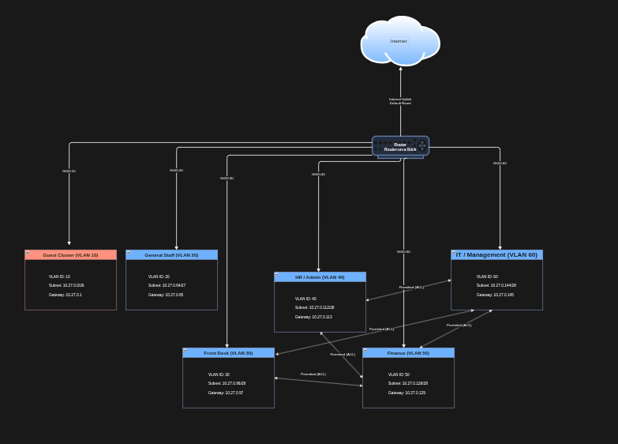
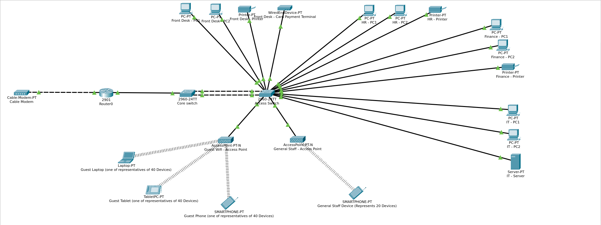

# Implementation

## Final Topology

The network consists of a router, two switches, and two access points. The router connects to the Core Switch through a single trunk link, carrying all VLAN traffic through router-on-a-stick sub-interfaces. The Core Switch connects to the Access Switch through an EtherChannel bundle of two links, as described in the Design Revisions document. All end devices, including both access points, connect to the Access Switch.

The router also connects to a modem, representing the uplink to the ISP, through a separate interface configured with NAT, allowing internal devices to reach the internet while keeping their private addressing hidden from outside the network.

The completed build in Cisco Packet Tracer, matching the topology above:

## VLAN and Port Assignment

Each zone from the Client Requirements document was implemented as a separate VLAN on both switches, with end devices connected to the Access Switch on access ports assigned to their corresponding VLAN.

| VLAN | Zone | Ports (Access Switch) |
|---|---|---|
| 10 | Guest Wifi | Fa0/15 (Access Point) |
| 20 | General Staff | Fa0/16 (Access Point) |
| 30 | Front Desk | Fa0/1 - Fa0/4 |
| 40 | HR / Admin | Fa0/5 - Fa0/7 |
| 50 | Finance | Fa0/8 - Fa0/10 |
| 60 | IT / Management | Fa0/11 - Fa0/14 |

IT / Management's documented four devices are represented by three physical devices, two PCs and one server, with the fourth port (Fa0/14) left reserved for future equipment, consistent with the client's scalability requirement under CR6.

## Router-on-a-Stick Configuration

The router's physical interface connecting to the Core Switch was configured with six sub-interfaces, one per VLAN, each using 802.1Q encapsulation and assigned the gateway address documented in the IP Addressing Plan.

| VLAN | Sub-interface | Gateway |
|---|---|---|
| 10 | Gi0/0.10 | 10.27.0.1 |
| 20 | Gi0/0.20 | 10.27.0.65 |
| 30 | Gi0/0.30 | 10.27.0.97 |
| 40 | Gi0/0.40 | 10.27.0.113 |
| 50 | Gi0/0.50 | 10.27.0.129 |
| 60 | Gi0/0.60 | 10.27.0.145 |

## Addressing

Guest Wifi and General Staff were configured with DHCP, since their devices are numerous and non-critical, as justified in the IP Addressing Plan. Front Desk, HR, Finance, and IT were configured with static addressing, since their devices are small in number and critical to daily operations.

## Access Control

Access control lists were configured on the router to enforce the traffic flow rules defined in the Logical Topology document, with refinements made during testing as detailed in the Design Revisions document.

Guest Wifi and General Staff are restricted to internet access only, with no access to any internal zone, including IT/Management. Front Desk is permitted to communicate with Finance and IT, but restricted from HR. HR is permitted to communicate with Finance and IT, but restricted from Front Desk. IT/Management has unrestricted access to Front Desk, HR, and Finance, but cannot reach Guest Wifi or General Staff, due to the stateless nature of access control lists, as explained in the Design Revisions document.

| Access Control List | Applied To | Purpose |
|---|---|---|
| 110 | Guest Wifi (Gi0/0.10) | Blocks all internal access, permits internet |
| 120 | General Staff (Gi0/0.20) | Blocks all internal access, permits internet |
| 130 | Front Desk (Gi0/0.30) | Permits Finance and IT, blocks HR, Guest Wifi, and General Staff |
| 140 | HR / Admin (Gi0/0.40) | Permits Finance and IT, blocks Front Desk, Guest Wifi, and General Staff |