# Testing Evidence

All tests were performed in Cisco Packet Tracer on the completed network build, using the `ping` command from each device's Command Prompt. Results reflect the final, corrected configuration after the access control list issues described in the Design Revisions document were resolved.

## 1. Guest Wifi and General Staff Isolation

| Source | Destination | Expected | Result |
|---|---|---|---|
| Guest Laptop | 10.27.0.98 (Front Desk) | Blocked | Blocked, destination host unreachable |
| Guest Laptop | 10.27.0.114 (HR) | Blocked | Blocked, destination host unreachable |
| Guest Laptop | 10.27.0.130 (Finance) | Blocked | Blocked, destination host unreachable |
| Guest Laptop | 10.27.0.146 (IT) | Blocked | Blocked, destination host unreachable |
| Guest Laptop | 8.8.8.8 (Internet) | Permitted | Permitted, request timed out at destination (expected, no real internet in simulation) |

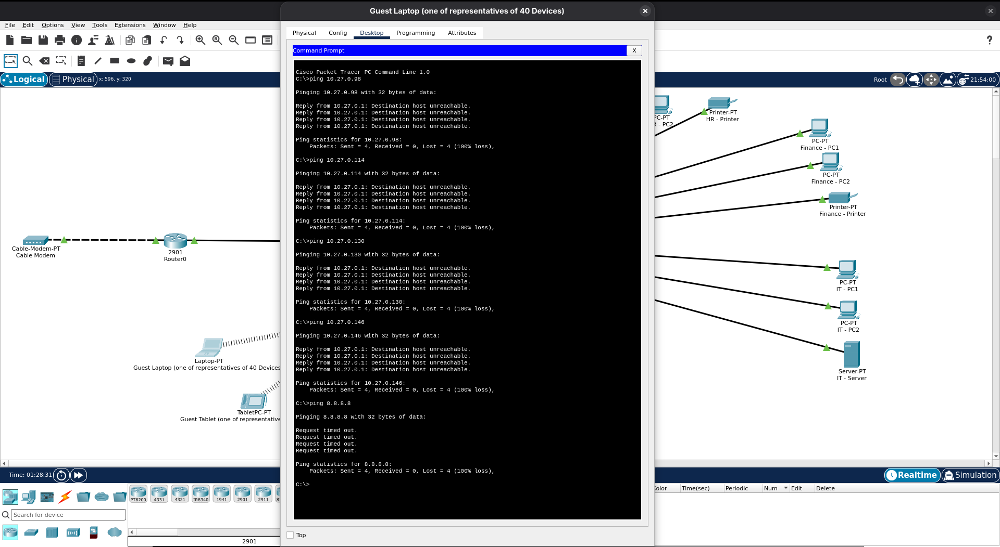

| Source | Destination | Expected | Result |
|---|---|---|---|
| General Staff Device | 10.27.0.98 (Front Desk) | Blocked | Blocked, destination host unreachable |
| General Staff Device | 10.27.0.114 (HR) | Blocked | Blocked, destination host unreachable |
| General Staff Device | 10.27.0.130 (Finance) | Blocked | Blocked, destination host unreachable |
| General Staff Device | 10.27.0.146 (IT) | Blocked | Blocked, destination host unreachable |
| General Staff Device | 8.8.8.8 (Internet) | Permitted | Permitted, request timed out at destination |

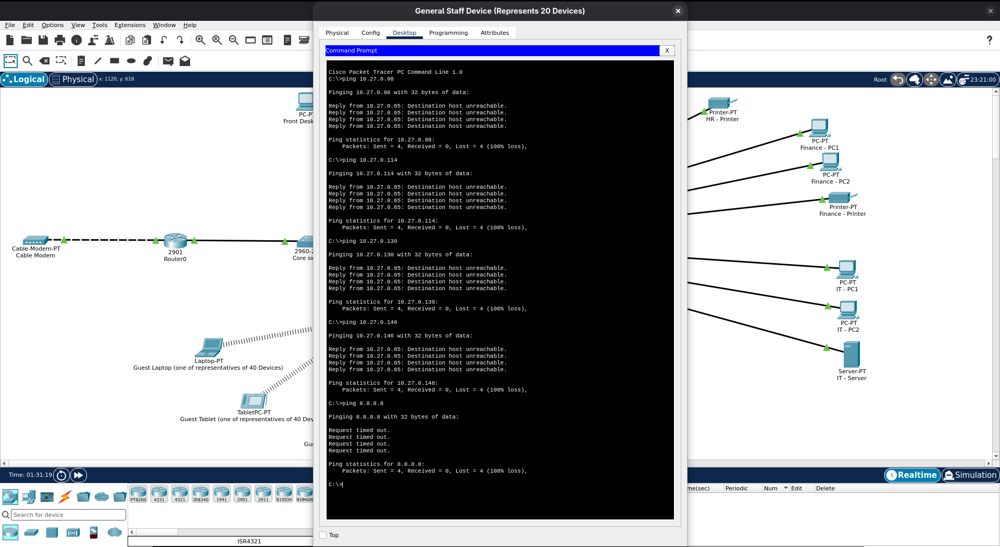

## 2. Front Desk Access

| Source | Destination | Expected | Result |
|---|---|---|---|
| Front Desk - PC1 | 10.27.0.130 (Finance) | Permitted | Permitted, 4/4 success |
| Front Desk - PC1 | 10.27.0.114 (HR) | Blocked | Blocked, destination host unreachable |
| Front Desk - PC1 | 10.27.0.146 (IT) | Permitted | Permitted, 4/4 success |
| Front Desk - PC1 | 8.8.8.8 (Internet) | Permitted | Permitted, request timed out at destination |

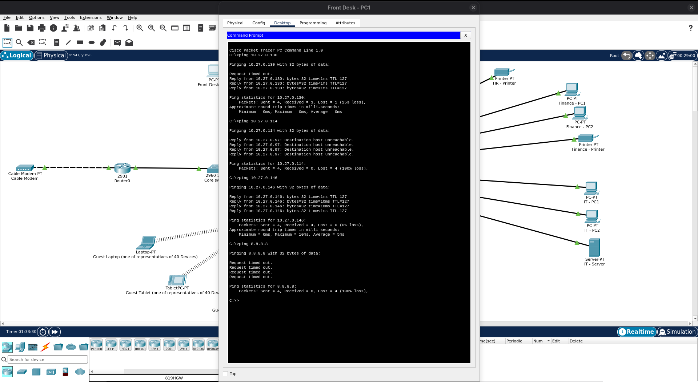

## 3. HR / Admin Access

| Source | Destination | Expected | Result |
|---|---|---|---|
| HR - PC1 | 10.27.0.130 (Finance) | Permitted | Permitted, 4/4 success |
| HR - PC1 | 10.27.0.98 (Front Desk) | Blocked | Blocked, destination host unreachable |
| HR - PC1 | 10.27.0.146 (IT) | Permitted | Permitted, 4/4 success |
| HR - PC1 | 8.8.8.8 (Internet) | Permitted | Permitted, request timed out at destination |

## 4. Finance Access

| Source | Destination | Expected | Result |
|---|---|---|---|
| Finance - PC1 | 10.27.0.98 (Front Desk) | Permitted | Permitted, 4/4 success |
| Finance - PC1 | 10.27.0.114 (HR) | Permitted | Permitted, 4/4 success |
| Finance - PC1 | 10.27.0.146 (IT) | Permitted | Permitted, 4/4 success |
| Finance - PC1 | 8.8.8.8 (Internet) | Permitted | Permitted, request timed out at destination |

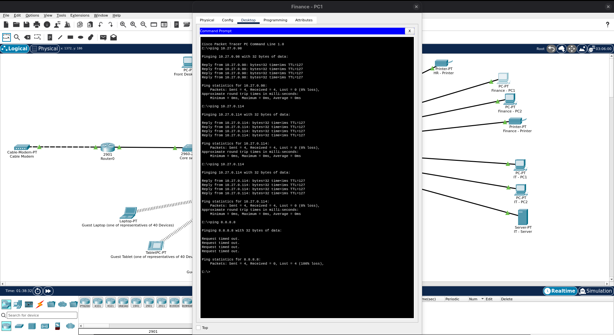

## 5. IT / Management Access

| Source | Destination | Expected | Result |
|---|---|---|---|
| IT - PC1 | 10.27.0.98 (Front Desk) | Permitted | Permitted, 4/4 success |
| IT - PC1 | 10.27.0.114 (HR) | Permitted | Permitted, 4/4 success |
| IT - PC1 | 10.27.0.130 (Finance) | Permitted | Permitted, 4/4 success |
| IT - PC1 | 10.27.0.2 (Guest Wifi) | Blocked | Blocked, request timed out (reply blocked by Guest Wifi's own access control list, see Design Revisions) |
| IT - PC1 | 10.27.0.66 (General Staff) | Blocked | Blocked, request timed out (reply blocked by General Staff's own access control list, see Design Revisions) |

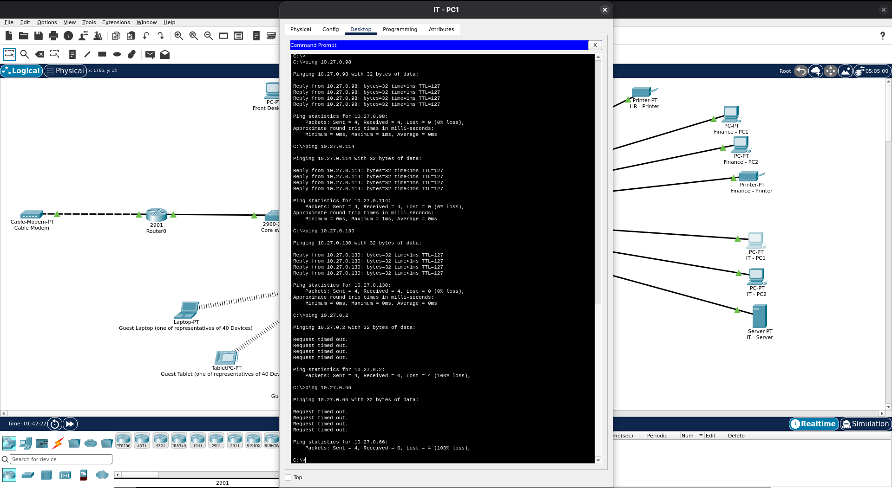

## 6. Supporting Configuration Evidence

**VLAN and port assignment**, confirming all six zones are correctly separated on the Access Switch:

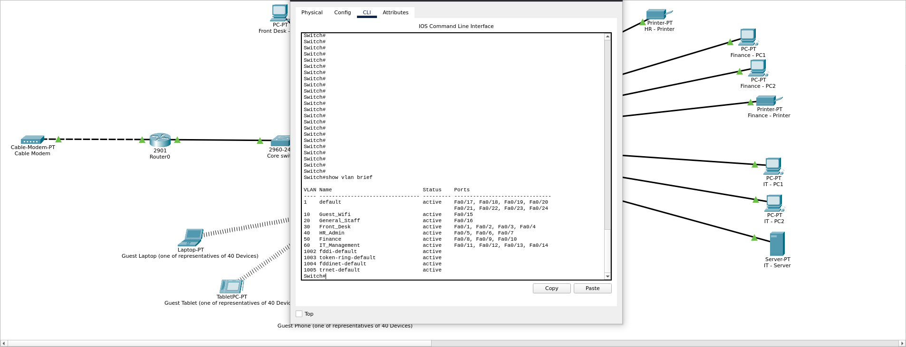

**EtherChannel status**, confirming the Core Switch to Access Switch link is bundled and active:

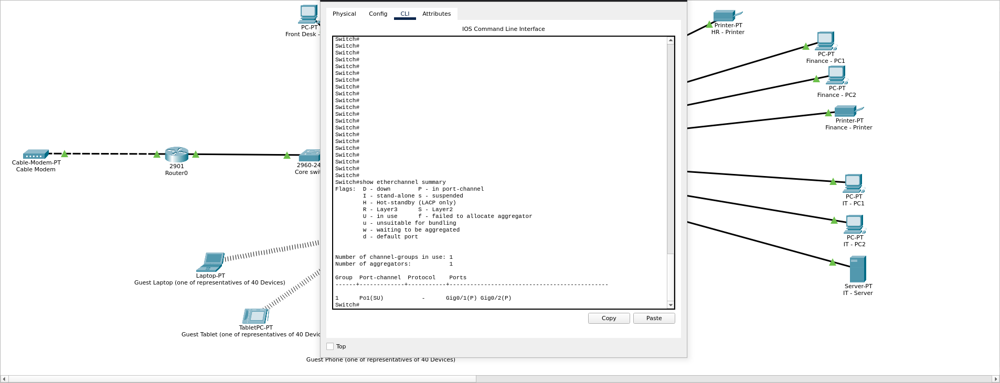

**Router sub-interfaces**, confirming router-on-a-stick is correctly configured for all six VLANs:

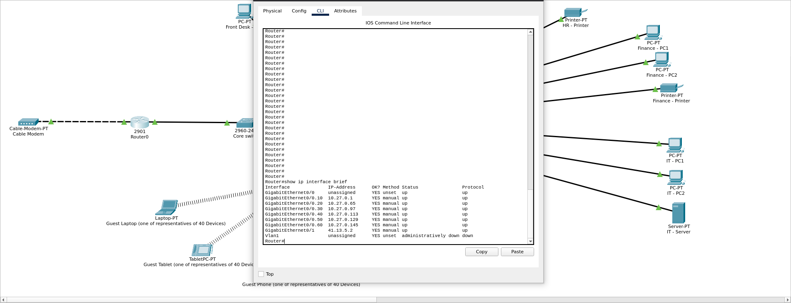

**Access control lists**, confirming all four ACLs are active and have matched real traffic generated during testing:

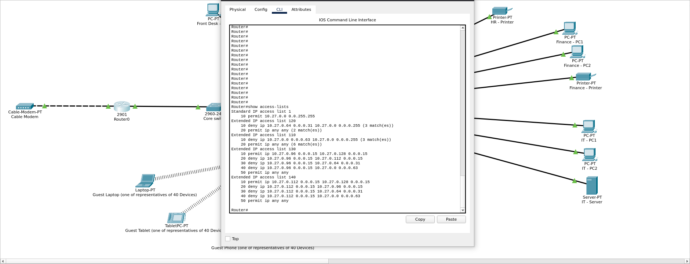

**DHCP assignment**, confirming Guest Wifi and General Staff devices receive correct addresses automatically:

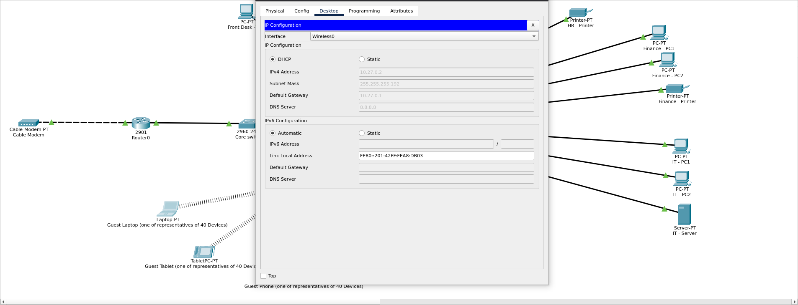

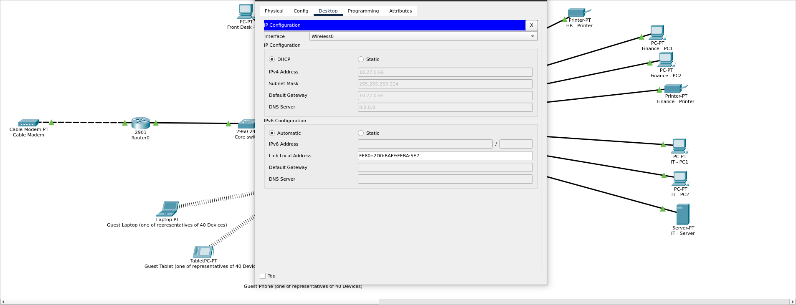

## Notes

The first ping along any new communication path commonly shows one request timing out before subsequent packets succeed. This is expected ARP resolution delay, the devices learning each other's MAC address, and is not a connectivity fault.

A distinction was observed between two forms of failure during testing. A reply of "Destination host unreachable" indicates the router actively denied the traffic due to an access control list. A result of "Request timed out" with no such reply indicates the traffic was permitted through the router but had no real destination to reach, as expected for the simulated internet address used in testing.

During testing, two issues were identified and corrected in the access control lists, as detailed in the Design Revisions document: a wildcard mask typo affecting General Staff's isolation, and the discovery that IT/Management cannot reach Guest Wifi or General Staff due to the stateless nature of access control lists.